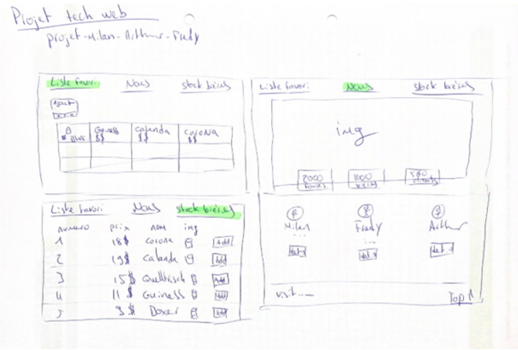
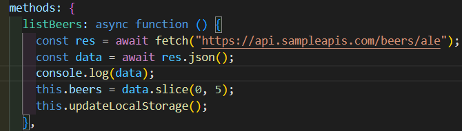

# App SBC (Suisse Beer Company)
## Application de gestion de bières pour particuliers 

## Problème 

Notre groupe d'études a identifié un besoin pour une application de gestion de bières pour les particuliers qui aiment conserver une liste de leurs bières favorites et suivre leur stock de bières à la maison. Ces particuliers ont besoin d'un moyen simple et efficace pour gérer leur collection de bières et savoir quelles bières ils ont en stock. 

### Solution 

Nous avons développé une application web en utilisant Node.js qui permet aux particuliers de gérer leur liste de bières favorites et suivre leur stock de bières à la maison. Les fonctionnalités de l'application comprennent : 

Ajout et suppression de bières à la liste des bières favorites 

Suivi du stock de bières (ajout, suppression) 

Visualisation des informations sur les bières (nom, image d’aperçu, prix) 

Nous avons utilisé une API (https://api.sampleapis.com) pour aller chercher les informations sur nos bières. Nous avons également utilisé les technologies web courantes telles que HTML, CSS, JavaScript et Bootstrap pour le développement de l'interface utilisateur. 

## Ce qui a fonctionné 

  

A partir de notre idée et du croquis ci-dessus, nous avons pu réaliser la petite application web de gestion de bières. 

## Ce qui a posé problème 
Notre groupe d'études a rencontré plusieurs défis au cours du développement de cette application. Tout d'abord, il a été difficile de décider sur les fonctionnalités à inclure dans l'application en fonction des besoins des utilisateurs. Nous avons également rencontré des difficultés techniques liées à la mise en place de la liste des bières favorites. 

## Principales leçons apprises 

* Il est important de bien comprendre et de se mettre d’accord sur les besoins des utilisateurs avant de développer une application. 

* Il est important de bien planifier les fonctionnalités de l'application en fonction des besoins des utilisateurs pour éviter les défis techniques. 

* Il est important de bien choisir les technologies à utiliser pour développer l'application pour éviter les pertes de temps. 

* Il est important de bien tester l'application avant de la rendre disponible pour les utilisateurs pour éviter les bugs et les problèmes en tout genre. 

## Retour d'expérience 
Le développement de cette application nous a permis de mettre en pratique les compétences apprises en cours, de découvrir de nouvelles technologies et de développer notre apprentissage en matière de développement web. Nous sommes fiers de la solution que nous avons développée et pensons qu'elle pourrait être utile pour les amateurs de bières qui souhaitent gérer leur collection de bières et suivre leur stock à la maison. 

En résumé, notre projet d'étude de l'application de gestion de bières pour particuliers a été une expérience enrichissante. Nous avons rencontré des défis, mais nous sommes convaincus que notre application pourrait être utile. 

## Schéma de l'architecture de l'application de gestion de bières pour particuliers 

Notre application a été développée en utilisant Node.js et Vue.js, et utilise une structure de dossiers qui s'articule autour de ces technologies. 

## Structure des imbrications des composants 

* Les composants de l'application se trouvent dans le dossier components, qui contient des sous-dossiers pour les différents types de composants (par exemple, icons, FooterComp.vue, NavComp.vue). 

* Les vues de l'application se trouvent dans le dossier views, qui contient des fichiers .vue pour chaque vue (par exemple, AboutView.vue, HomeView.vue, PostsView.vue,  StockBieres.vue, App.vue). 

* Les routes de l'application se trouvent dans le dossier router, qui contient un fichier index.js pour configurer les routes. 

## Accès aux données 

Les données de l'application sont stockées dans une API (https://api.sampleapis.com) 

Les instructions pour accéder et manipuler les données sont effectuées par notre méthode ci-dessous :

  

* Les données sont ensuite envoyées à l'interface utilisateur via des composants Vue.js qui les affichent et permettent aux utilisateurs d’y accéder. 

